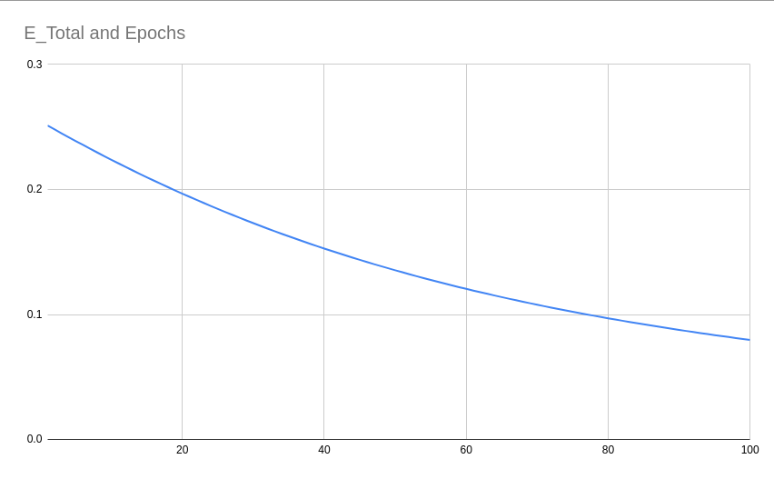

# Assignment 4

## Part 1

The excel sheet contains an example to train a deep neural network in excel. There are 2 major parts in it -

1. Forward Propagation
2. Backward Propagation

### Forward Propagation

We have an input of dimenisonality 2 which is fed to the network. The inputs are denoted by `x1` and `x2`.

The network consists of an input layers, a hidden layers, and an output layer. Each layer is followed by an activation function to introduce non-linearity into the network.

- Input: `x1, x2`
- output: `y1, y2`
- Weights: `w1, w2, w3, w4, w5, w6, w7, w8`
- Intermediate outputs: `h1, a_h1, o1, o2`
- Final Output: `a_o1, a_o2`
- MSE Loss: `E1, E2`

Although the parameters are initialised randomly, for our exercise we choose the following values.

| w1  | w2  |  w3  | w4  | w5  |  w6  | w7  |  w8  |
| :-: | :-: | :--: | :-: | :-: | :--: | :-: | :--: |
| 0.3 | 0.5 | -0.2 | 0.7 | 0.1 | -0.6 | 0.3 | -0.9 |

The inputs `x1` and `x2` are used to calculate the neuron values of the hidden layer using the following equation.

`h1 = (w1 * x1) + (w2 * x2)`

`h2 = (w3 * x1) + (w4 * x2)`

These outputs are then passed through a sigmoid function.

`a_h1 = σ(h1) = 1/(1 + exp(-h1))`

`a_h2 = σ(h2) = 1/(1 + exp(-h2))`

Once we have the middle neurons, we then calculate the output neurons using the following equations.

`o1 (w5 * a_h1) * (w6 * a_h2)`

`o2 (w7 * a_h1) * (w8 * a_h2)`

Activations of these outputs.

`a_o1 = σ(o1) = 1/(1 + exp(-o1))`

`a_o2 = σ(o2) = 1/(1 + exp(-o2))`

Once we have the output from the network, we calculate the Mean Squared Error loss using our actual outputs.

`E1 = 0.5 * (y1 - a_o1)²`

`E2 = 0.5 * (y2 - a_o2)²`

Finally, we calculate the total loss using which we'll perform backpropagation.

`E_Total E1 + E2`

### Backward Propagation

During backpropagation, we first calculate the derivative of the total error with respect to all the weights using chain rule.

The final equations are:

`∂E_Total/∂w8 = (a_o2 - y2) * a_o2 * (1 - a_o2) * a_h2`

`∂E_Total/∂w7 = (a_o2 - y2) * a_o2 * (1 - a_o2) * a_h1`

`∂E_Total/∂w6 = (a_o1 - y1) * a_o1 * (1 - a_o1) * a_h2`

`∂E_Total/∂w5 = (a_o1 - y1) * a_o1 * (1 - a_o1) * a_h1`

`∂E_Total/∂w4 = [(a_o1 - y1) * a_o1 * (1 - a_o1) * w6 + (a_o2 - y2) * a_o2 * (1 - a_o2) * w8] * a_h2 * (1 - a_h2) * x2`

`∂E_Total/∂w3 = [(a_o1 - y1) * a_o1 * (1 - a_o1) * w6 + (a_o2 - y2) * a_o2 * (1 - a_o2) * w8] * a_h2 * (1 - a_h2) * x1`

`∂E_Total/∂w2 = [(a_o1 - y1) * a_o1 * (1 - a_o1) * w5 + (a_o2 - y2) * a_o2 * (1 - a_o2) * w7] * a_h1 * (1 - a_h1) * x2`

`∂E_Total/∂w1 = [(a_o1 - y1) * a_o1 * (1 - a_o1) * w5 + (a_o2 - y2) * a_o2 * (1 - a_o2) * w7] * a_h1 * (1 - a_h1) * x1`

Once we the gradients, we update the weights using the following equation.

`w_new = w_old - (LR * ∂E/∂w)`

`LR` is the learning rate which is used to ensure the update step aren't too large. If the LR is too big, the network may not converge at all.

### Learning Rate Experiment

Increasing the learning leads to faster convergence in 100 epochs. The total error reduces quickly for a higher learning rate.

- LR = 0.1
  

- LR = 0.2
  

- LR = 0.5
  

- LR = 0.8
  

- LR = 1.0
  

- LR = 2.0
  

### Screenshot

The excel sheet is present in `./part1/`. Here's a screenshot of the file.


## Part 2

The notebook is saved in the folder `./S4/`.

Test Accuracy: `99.44%`.

The network uses conv2d, skip-connections, batchnorm, dropout, relu, global average pooling, and linear layers. Data augmentation with random-rotation(10 degrees) is used.

The size of the network is -

```
----------------------------------------------------------------
Total params: 19,730
Trainable params: 19,730
Non-trainable params: 0
----------------------------------------------------------------
Input size (MB): 0.00
Forward/backward pass size (MB): 1.26
Params size (MB): 0.08
Estimated Total Size (MB): 1.34
----------------------------------------------------------------
```

The network architecture is as follows -

The BaseBlock consists of 2 convolutional layers where the input is added to the final output. This network consists of 6 such BaseBlocks. First two BaseBlocks use 8 channels while the final two BaseBlocks uses 16.

Finally, the output of this cnn part, with an RF of 60, goes throught GAP which makes the heigh and width equal to 1. Finally, this tensor is squeezed and passed through a final linear layer.

```
----------------------------------------------------------------
        Layer (type)               Output Shape         Param #
================================================================
            Conv2d-1            [-1, 8, 28, 28]              80
       BatchNorm2d-2            [-1, 8, 28, 28]              16
              ReLU-3            [-1, 8, 28, 28]               0
         Dropout2d-4            [-1, 8, 28, 28]               0
            Conv2d-5            [-1, 8, 28, 28]             584
       BatchNorm2d-6            [-1, 8, 28, 28]              16
              ReLU-7            [-1, 8, 28, 28]               0
         BaseBlock-8            [-1, 8, 28, 28]               0
            Conv2d-9            [-1, 8, 28, 28]             584
      BatchNorm2d-10            [-1, 8, 28, 28]              16
             ReLU-11            [-1, 8, 28, 28]               0
        Dropout2d-12            [-1, 8, 28, 28]               0
           Conv2d-13            [-1, 8, 28, 28]             584
      BatchNorm2d-14            [-1, 8, 28, 28]              16
             ReLU-15            [-1, 8, 28, 28]               0
        BaseBlock-16            [-1, 8, 28, 28]               0
        MaxPool2d-17            [-1, 8, 14, 14]               0
           Conv2d-18           [-1, 16, 14, 14]           1,168
      BatchNorm2d-19           [-1, 16, 14, 14]              32
             ReLU-20           [-1, 16, 14, 14]               0
        Dropout2d-21           [-1, 16, 14, 14]               0
           Conv2d-22           [-1, 16, 14, 14]           2,320
      BatchNorm2d-23           [-1, 16, 14, 14]              32
             ReLU-24           [-1, 16, 14, 14]               0
        BaseBlock-25           [-1, 16, 14, 14]               0
           Conv2d-26           [-1, 16, 14, 14]           2,320
      BatchNorm2d-27           [-1, 16, 14, 14]              32
             ReLU-28           [-1, 16, 14, 14]               0
        Dropout2d-29           [-1, 16, 14, 14]               0
           Conv2d-30           [-1, 16, 14, 14]           2,320
      BatchNorm2d-31           [-1, 16, 14, 14]              32
             ReLU-32           [-1, 16, 14, 14]               0
        BaseBlock-33           [-1, 16, 14, 14]               0
        MaxPool2d-34             [-1, 16, 7, 7]               0
           Conv2d-35             [-1, 16, 7, 7]           2,320
      BatchNorm2d-36             [-1, 16, 7, 7]              32
             ReLU-37             [-1, 16, 7, 7]               0
        Dropout2d-38             [-1, 16, 7, 7]               0
           Conv2d-39             [-1, 16, 7, 7]           2,320
      BatchNorm2d-40             [-1, 16, 7, 7]              32
             ReLU-41             [-1, 16, 7, 7]               0
        BaseBlock-42             [-1, 16, 7, 7]               0
           Conv2d-43             [-1, 16, 7, 7]           2,320
      BatchNorm2d-44             [-1, 16, 7, 7]              32
             ReLU-45             [-1, 16, 7, 7]               0
        Dropout2d-46             [-1, 16, 7, 7]               0
           Conv2d-47             [-1, 16, 7, 7]           2,320
      BatchNorm2d-48             [-1, 16, 7, 7]              32
             ReLU-49             [-1, 16, 7, 7]               0
        BaseBlock-50             [-1, 16, 7, 7]               0
        AvgPool2d-51             [-1, 16, 1, 1]               0
           Linear-52                   [-1, 10]             170
```

The base block used is -


Complete network:


